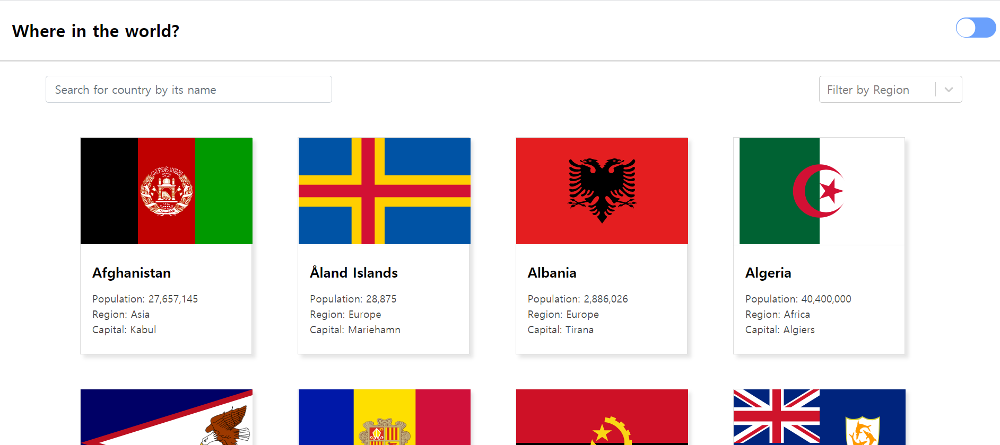
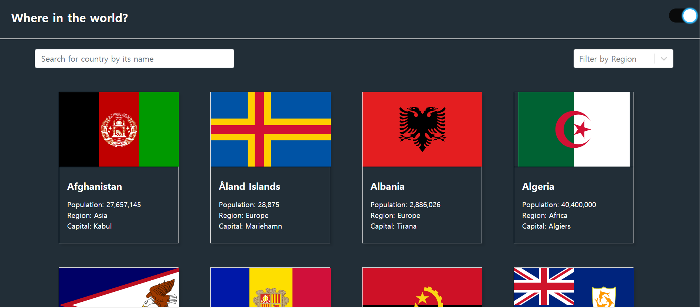
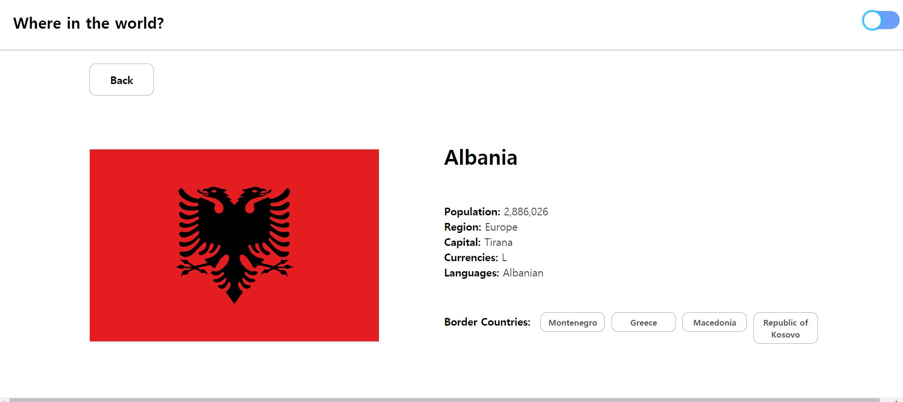
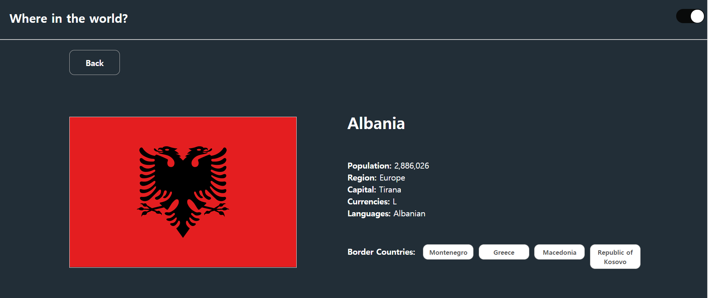

### Displaying country list using REST API ✈

---

#### What I used for this project

- React
- Typescript
- Redux-toolkit for state management
- Styled-component for making responsive website and color-theme mode
- Throttling and debouncing for improving user experience
- REST API for fetching data

---

#### What it looks like ✨

